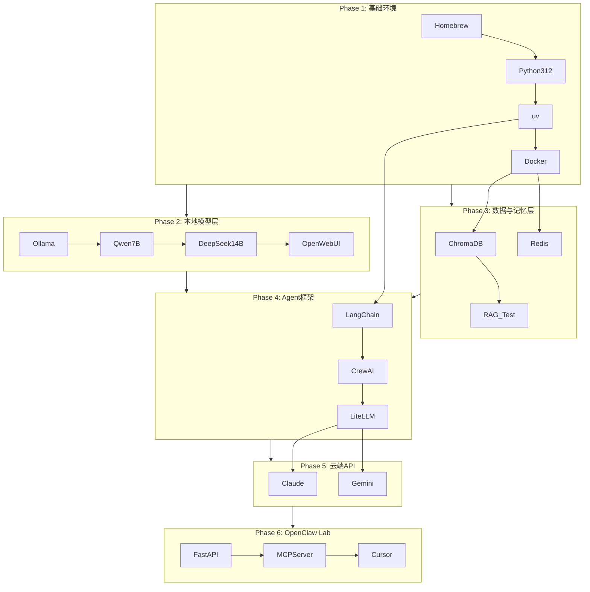

# OpenClaw AI Lab — Mac Mini M4 分步安装计划

## 架构总览




---

## Phase 1: 基础环境搭建

### 步骤 1.1 — 安装 Homebrew

```bash
/bin/bash -c "$(curl -fsSL https://raw.githubusercontent.com/Homebrew/install/HEAD/install.sh)"
# 安装后执行（M4 路径）
echo 'eval "$(/opt/homebrew/bin/brew shellenv)"' >> ~/.zprofile
eval "$(/opt/homebrew/bin/brew shellenv)"
```

**测试 1.1**

```bash
brew --version
# 期望输出：Homebrew 4.x.x
brew doctor
# 期望输出：Your system is ready to brew.
```

---

### 步骤 1.2 — 安装 Python 3.12 + uv

```bash
brew install python@3.12
# 安装 uv（极快的 Python 包管理器）
curl -LsSf https://astral.sh/uv/install.sh | sh
source ~/.zprofile
```

**测试 1.2**

```bash
python3.12 --version   # Python 3.12.x
uv --version           # uv 0.x.x
uv python list         # 确认 3.12 在列表中
```

---

### 步骤 1.3 — 安装 Docker Desktop for Mac (Apple Silicon)

- 下载：[https://www.docker.com/products/docker-desktop/](https://www.docker.com/products/docker-desktop/)
- 安装后打开 Docker Desktop，等待绿色状态灯

**测试 1.3**

```bash
docker --version       # Docker version 27.x.x
docker compose version # Docker Compose version v2.x.x
docker run hello-world # 期望：Hello from Docker!
```

---

### 步骤 1.4 — 安装 Just（命令快捷脚本工具）

```bash
brew install just
```

**测试 1.4**

```bash
just --version  # just x.x.x
```

---

## Phase 2: 本地模型层

### 步骤 2.1 — 安装 Ollama

```bash
brew install ollama
# 或下载官方安装包：https://ollama.com/download/mac
ollama serve &  # 后台启动
```

**测试 2.1**

```bash
curl http://localhost:11434/api/tags
# 期望：{"models":[]} 或模型列表 JSON
```

---

### 步骤 2.2 — 拉取并测试 Qwen2.5-7B（首选轻量模型）

```bash
ollama pull qwen2.5:7b
```

**测试 2.2**

```bash
ollama run qwen2.5:7b "用中文介绍你自己，用3句话"
# 期望：流畅中文回复，速度 >20 token/s
# 同时观察 Activity Monitor → GPU History，应有明显 GPU 使用率
```

---

### 步骤 2.3 — 拉取并测试 DeepSeek-R1-14B

```bash
ollama pull deepseek-r1:14b
```

**测试 2.3**

```bash
ollama run deepseek-r1:14b "计算 1234 × 5678，逐步说明"
# 期望：正确推理步骤，速度 >10 token/s
# 检查内存：Activity Monitor → Memory，应在 12~15GB 范围内
```

---

### 步骤 2.4 — 安装 Open WebUI（可视化管理界面）

```bash
docker run -d \
  --name open-webui \
  -p 3000:8080 \
  -v open-webui:/app/backend/data \
  -e OLLAMA_BASE_URL=http://host.docker.internal:11434 \
  ghcr.io/open-webui/open-webui:main
```

**测试 2.4**

- 浏览器打开 [http://localhost:3000](http://localhost:3000)
- 注册账号，选择 qwen2.5:7b，发送一条消息
- 期望：正常对话，左侧模型列表显示已安装模型

---

## Phase 3: 数据与记忆层

### 步骤 3.1 — 用 Docker Compose 启动 ChromaDB + Redis

创建文件 `~/openclaw/docker/docker-compose.yml`：

```yaml
services:
  chroma:
    image: chromadb/chroma:latest
    ports:
      - "8001:8000"
    volumes:
      - chroma_data:/chroma/chroma
  redis:
    image: redis:7-alpine
    ports:
      - "6379:6379"
volumes:
  chroma_data:
```

```bash
cd ~/openclaw/docker
docker compose up -d
```

**测试 3.1**

```bash
# 测试 ChromaDB
curl http://localhost:8001/api/v1/heartbeat
# 期望：{"nanosecond heartbeat": ...}

# 测试 Redis
docker exec -it docker-redis-1 redis-cli ping
# 期望：PONG
```

---

### 步骤 3.2 — 验证 ChromaDB Python 连接

```bash
uv pip install chromadb
python3.12 -c "
import chromadb
client = chromadb.HttpClient(host='localhost', port=8001)
col = client.get_or_create_collection('test')
col.add(documents=['OpenClaw AI Lab 测试文档'], ids=['doc1'])
result = col.query(query_texts=['AI Lab'], n_results=1)
print(result['documents'])
"
```

**期望输出**：`[['OpenClaw AI Lab 测试文档']]`

---

## Phase 4: Agent 框架搭建

### 步骤 4.1 — 初始化 OpenClaw 项目

```bash
mkdir -p ~/openclaw && cd ~/openclaw
uv init --name openclaw --python 3.12
uv add langchain langchain-community langgraph
uv add crewai crewai-tools
uv add openai anthropic google-generativeai
uv add litellm
uv add fastapi uvicorn[standard] httpx pydantic
uv add chromadb redis python-dotenv
```

**测试 4.1**

```bash
uv run python -c "import langchain, crewai, litellm; print('所有包导入成功')"
```

---

### 步骤 4.2 — 测试 LiteLLM 路由本地模型

```bash
uv run python -c "
from litellm import completion
resp = completion(
    model='ollama/qwen2.5:7b',
    messages=[{'role':'user','content':'用一句话说你好'}],
    api_base='http://localhost:11434'
)
print(resp.choices[0].message.content)
"
```

**期望**：正常回复，无报错

---

### 步骤 4.3 — 测试 LangChain + Ollama 集成

```bash
uv run python -c "
from langchain_community.llms import Ollama
llm = Ollama(model='qwen2.5:7b')
print(llm.invoke('用一句话描述 LangChain 是什么'))
"
```

---

### 步骤 4.4 — 测试 CrewAI 双 Agent 协作（Builder + Reviewer）

创建测试脚本 `~/openclaw/experiments/test_crew.py`，运行一个简单 Builder + Reviewer Crew，期望两个 Agent 顺序完成任务并输出结果。

---

## Phase 5: 云端 API 连接

### 步骤 5.1 — 配置环境变量

创建 `~/openclaw/.env`：

```
ANTHROPIC_API_KEY=sk-ant-...
GOOGLE_API_KEY=AIza...
OLLAMA_BASE_URL=http://localhost:11434
CHROMA_HOST=localhost
CHROMA_PORT=8001
REDIS_URL=redis://localhost:6379
```

**测试 5.1 — Claude API**

```bash
uv run python -c "
import anthropic, os
from dotenv import load_dotenv
load_dotenv()
client = anthropic.Anthropic()
msg = client.messages.create(
    model='claude-3-5-haiku-20241022',
    max_tokens=100,
    messages=[{'role':'user','content':'用一句话打招呼'}]
)
print(msg.content[0].text)
"
```

**测试 5.1 — Gemini API**

```bash
uv run python -c "
import google.generativeai as genai, os
from dotenv import load_dotenv
load_dotenv()
genai.configure(api_key=os.getenv('GOOGLE_API_KEY'))
model = genai.GenerativeModel('gemini-2.0-flash')
print(model.generate_content('用一句话打招呼').text)
"
```

---

### 步骤 5.2 — 测试 LiteLLM 统一路由（本地 + 云端）

```bash
uv run python -c "
from litellm import completion
import os
from dotenv import load_dotenv
load_dotenv()

models = [
    ('ollama/qwen2.5:7b', {'api_base': 'http://localhost:11434'}),
    ('claude-3-5-haiku-20241022', {}),
    ('gemini/gemini-2.0-flash', {}),
]
for model, kwargs in models:
    resp = completion(model=model,
        messages=[{'role':'user','content':'说：我已连接'}], **kwargs)
    print(f'{model}: {resp.choices[0].message.content}')
"
```

**期望**：三行输出，每个模型各一条回复

---

## Phase 6: OpenClaw Lab API + MCP 服务

### 步骤 6.1 — 启动 FastAPI 本地服务

创建 `~/openclaw/lab/api/main.py` 基础版本，包含 `/chat` 和 `/health` 端点。

```bash
uv run uvicorn lab.api.main:app --reload --port 8080
```

**测试 6.1**

```bash
curl http://localhost:8080/health
# 期望：{"status":"ok","models":["qwen2.5:7b","deepseek-r1:14b"]}

curl -X POST http://localhost:8080/chat \
  -H "Content-Type: application/json" \
  -d '{"message":"你好","model":"qwen2.5:7b"}'
# 期望：正常 JSON 回复
```

---

### 步骤 6.2 — 配置 MCP Server 供 Cursor 调用

在 `~/openclaw/lab/api/mcp_server.py` 实现 MCP 协议端点，然后在 Cursor 设置中添加：

```json
{
  "mcpServers": {
    "openclaw": {
      "url": "http://localhost:8080/mcp",
      "type": "http"
    }
  }
}
```

**测试 6.2**

- 在 Cursor 中打开 MCP 面板，确认 openclaw 服务器状态为绿色连接
- 在 Cursor 对话中调用一个 OpenClaw 工具，验证响应正常

---

## 完整安装时序与预估时间


| Phase | 内容           | 预估时间     | 主要瓶颈                 |
| ----- | ------------ | -------- | -------------------- |
| 1     | 基础环境         | 20~30 分钟 | Homebrew 下载速度        |
| 2     | 本地模型         | 60~90 分钟 | 模型下载（7B≈4GB，14B≈8GB） |
| 3     | 数据层          | 15 分钟    | Docker 镜像拉取          |
| 4     | Agent 框架     | 20 分钟    | uv 安装依赖              |
| 5     | 云端 API       | 10 分钟    | 需提前准备 API Key        |
| 6     | OpenClaw API | 30 分钟    | 代码编写                 |


**总计：约 3~4 小时**（网络良好情况下）

---

## 常见问题预案

- **Ollama 无法启动**：检查 `launchctl list | grep ollama`，重启服务
- **模型推理慢**：确认 `ollama ps` 显示 GPU 加速，非 CPU-only
- **ChromaDB 连接失败**：检查 Docker 容器状态 `docker ps`
- **LiteLLM 路由报错**：确认 `.env` 中 API Key 格式正确，无多余空格

